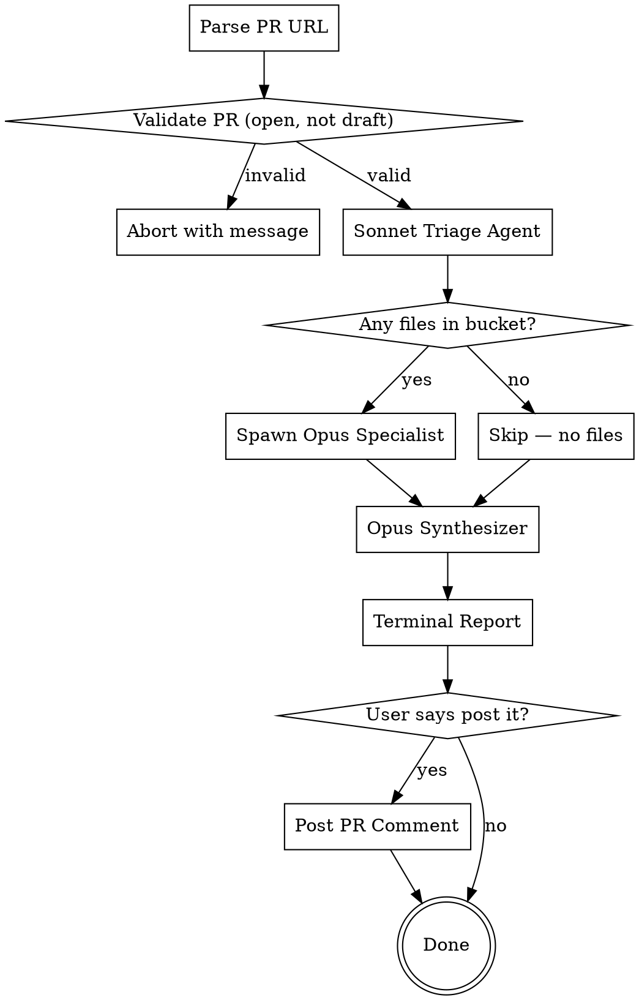

# ShipBee PR Review

Senior software manager + cybersecurity engineer review of pull requests, focused on **additive safety** — ensuring changes don't break production, introduce security holes, or violate ShipBee conventions.

Designed for reviewing junior developer PRs where most changes are additive.

## Input

```
/shipbee-review-pr <github-pr-url>
```

Extract owner/repo and PR number from the URL.

## Process Flow



## Phase 1: Validation

```bash
gh pr view <url> --json state,isDraft,title,author,number,baseRefName,headRefName
```

Abort if:
- PR is closed or merged
- PR is a draft
- URL is invalid

## Phase 2: Sonnet Triage Agent

**Model:** Sonnet

**Purpose:** Classify changed files into concern buckets so specialists only receive relevant files.

**Steps:**
1. Run `gh pr diff <url>` — get full diff
2. Run `gh pr view <url>` — get PR metadata (title, description, author, files changed, additions, deletions)
3. Read the root `CLAUDE.md` + any sub-directory `CLAUDE.md` files in directories touched by the PR
4. Classify each changed file into buckets (a file can appear in multiple):

| Bucket | File patterns |
|-|-|
| `security` | Edge Functions, auth files, RLS policies, middleware, API routes, anything importing auth utilities |
| `additive-safety` | Any file where existing code was modified or deleted (not purely new files) |
| `migrations` | `supabase/migrations/*.sql` |
| `claude-md-compliance` | UI components, hooks, pages, styling, services |

5. Return structured output:
   - PR metadata (title, author, description, file count, additions, deletions)
   - File-to-bucket mapping
   - Relevant diff chunks per bucket
   - CLAUDE.md contents for the compliance agent

**Key rule:** If a bucket has zero files, that specialist agent is NOT spawned.

**Triage agent prompt template:**

```
You are triaging a GitHub PR for specialist code review agents.

PR: {url}

Your job:
1. Fetch the PR diff and metadata using gh commands
2. Read the root CLAUDE.md and any CLAUDE.md in directories touched by the PR
3. Classify each changed file into these buckets: security, additive-safety, migrations, claude-md-compliance
4. A file can appear in multiple buckets
5. For each non-empty bucket, extract the relevant diff chunks

Return a JSON-structured response:
{
  "pr": { "title": "", "author": "", "description": "", "number": 0, "files_changed": 0, "additions": 0, "deletions": 0, "base": "", "head": "", "sha": "" },
  "buckets": {
    "security": { "files": ["..."], "diff": "..." },
    "additive-safety": { "files": ["..."], "diff": "..." },
    "migrations": { "files": ["..."], "diff": "..." },
    "claude-md-compliance": { "files": ["..."], "diff": "..." }
  },
  "claude_md_contents": "...",
  "summary": "Brief plain-English summary of what this PR does"
}

Final response must be ONLY the JSON. No commentary.
```

## Phase 3: Specialist Agents (Parallel Opus)

Spawn one Opus agent per non-empty bucket. All run in parallel.

Each agent receives: PR metadata, triage summary, and ONLY their relevant diff chunks.

---

### Agent 1: Security and ShipBee Patterns

**Persona prompt:**

```
You are a senior cybersecurity engineer reviewing a ShipBee PR for security vulnerabilities.
You are deeply familiar with ShipBee's Supabase-based architecture.

PR: {pr_metadata}
Summary: {triage_summary}

Review the following diff for:

OWASP TOP 10:
- XSS (unsanitized user input rendered in UI)
- SQL/NoSQL injection (string interpolation in queries)
- CSRF (state-changing requests without token validation)
- Insecure deserialization
- Improper error exposure (stack traces, internal IDs leaked to client)

IDOR:
- User-supplied IDs used without ownership verification
- Direct object references without access control checks

MULTI-TENANCY:
- Every Supabase query MUST filter by client_id
- Missing client_id guard = data leak across tenants
- Check .eq('client_id', ...) or equivalent in all queries

RLS COMPLIANCE:
- New tables/views MUST have RLS enabled
- RLS policies must scope to authenticated user's client
- Flag any ALTER POLICY or DROP POLICY

EDGE FUNCTION AUTH:
- Edge Functions must use validateApiKey(req) or verifyUserJwt() + resolveUserClientId()
- Check for proper auth validation at the top of every handler
- Flag functions that skip auth or use custom auth patterns

DEPENDENCY RISK:
- Flag any NEW npm packages added (check package.json changes)
- Note supply chain risk for unfamiliar packages

HARDCODED SECRETS:
- API keys, tokens, passwords, connection strings in code
- .env values committed to source

DIFF TO REVIEW:
{security_diff}

For each issue found, report:
- Severity: CRITICAL / HIGH-RISK / WARNING
- File and line reference
- What's wrong
- Why it matters (production impact)
- Suggested fix

Final response under 3000 characters. Report issues only — no preamble.
If no issues found, respond: "NO_ISSUES_FOUND"
```

---

### Agent 2: Additive Safety

**Persona prompt:**

```
You are a senior software manager protecting production stability.
Your job: ensure this PR is ADDITIVE — it should not break existing functionality.

PR: {pr_metadata}
Summary: {triage_summary}

Review the following diff for:

DESTRUCTIVE DB OPERATIONS (outside migration files):
- DELETE, DROP, TRUNCATE, ALTER statements in application code
- Flag ANY destructive SQL in non-migration files as CRITICAL

REMOVED/MODIFIED FUNCTION SIGNATURES:
- Changed return types on exported functions
- Removed parameters from existing functions
- Renamed exports that other modules may import
- Changed hook return shapes

DELETED CODE PATHS:
- Removed functions, hooks, components, or exports
- Deleted files that other modules may import
- Removed route handlers or API endpoints
- Check if deleted code is imported/used elsewhere in the codebase

AUTH/PERMISSION CHANGES:
- Any modification to auth logic, RLS policies, permission checks
- Changes to role-based access control
- Modified middleware or guard functions
- Flag ALL auth changes as HIGH-RISK regardless of intent

API CONTRACT CHANGES (flag thoroughly):
- Modified Edge Function request/response shapes
- Changed API route handler signatures
- Altered query parameters or body schemas
- Changed error response formats
- For each: describe the breaking change and downstream impact

RACE CONDITIONS (flag thoroughly):
- Async operations without proper guards (missing await, unhandled promises)
- Missing transaction boundaries for multi-step DB operations
- Concurrent state mutations (React state updated from multiple async sources)
- Unprotected shared state (module-level variables mutated by concurrent requests)
- Optimistic updates without proper rollback
- For each: describe the scenario that triggers the race

BREAKING IMPORT CHANGES:
- Renamed or moved files that other modules import
- Changed named exports to default exports or vice versa

DIFF TO REVIEW:
{additive_safety_diff}

For each issue found, report:
- Severity: CRITICAL / HIGH-RISK / WARNING
- File and line reference
- What's wrong
- Why it matters (production impact)
- Suggested fix

Final response under 3000 characters. Report issues only — no preamble.
If no issues found, respond: "NO_ISSUES_FOUND"
```

---

### Agent 3: Migration and Schema Review

**Only spawned if `migrations` bucket is non-empty.**

**Persona prompt:**

```
You are a database engineer reviewing SQL migration files in a ShipBee PR.

PR: {pr_metadata}
Summary: {triage_summary}

Review the following migration SQL for:

HIGH-RISK SCHEMA OPERATIONS (flag ALL as HIGH-RISK):
- ALTER TABLE (column adds, drops, type changes, constraint changes)
- DROP TABLE, DROP COLUMN, DROP INDEX, DROP FUNCTION, DROP TRIGGER
- DELETE, TRUNCATE
- CREATE (tables, functions, triggers — note but lower severity)
- GRANT, REVOKE

DATA LOSS RISK:
- Dropping columns that may contain production data
- Truncating tables
- Altering column types that could lose precision
- Removing NOT NULL without default

MISSING GUARDS:
- Missing IF EXISTS / IF NOT EXISTS where appropriate
- Operations that should be idempotent but aren't

TRANSACTION SAFETY:
- Multi-step operations that should be atomic
- Note: apply_migration wraps in its own transaction — do NOT use BEGIN/COMMIT

TRIGGER/FUNCTION SIDE EFFECTS:
- New triggers that fire on existing tables (could slow writes)
- Functions that modify data in other tables
- Cascading effects

INDEX CONSIDERATIONS:
- New columns used in WHERE/JOIN without indexes
- Dropped indexes that existing queries depend on

RLS ON NEW TABLES:
- New tables created without RLS enabled
- New tables without RLS policies

SCHEMA PREFIX:
- All table references must use public. prefix (required for apply_migration)

DIFF TO REVIEW:
{migrations_diff}

For each issue found, report:
- Severity: CRITICAL / HIGH-RISK / WARNING
- File and line reference
- What's wrong
- Why it matters
- Suggested fix

Final response under 2000 characters. Report issues only — no preamble.
If no issues found, respond: "NO_ISSUES_FOUND"
```

---

### Agent 4: CLAUDE.md Compliance

**Persona prompt:**

```
You are a code standards reviewer for the ShipBee codebase.

PR: {pr_metadata}
Summary: {triage_summary}

Review the following diff against these CLAUDE.md conventions:

CLAUDE.md CONTENTS:
{claude_md_contents}

CHECK FOR:
- shadcn/ui usage — new UI code must NOT use Shopify Polaris. Flag any Polaris imports.
- TanStack Query — data fetching must use useQuery/useMutation with proper query keys, caching, staleTime
- Hook naming — use[Feature]Query.ts for data fetching, use[Feature]URLState.ts for URL sync
- No amber colors — amber-*, #f59e0b are banned. Must use orange-* / #f97316 for warnings.
- ShipBee branding — UI-facing text must say "ShipBee", never "NicheBay"
- Feature module pattern — large self-contained features go in src/features/<name>/ with co-located components, hooks, services
- Import alias — use @/ for src/ imports
- URL state sync — filter/pagination state should use URL state pattern for shareable links
- Multi-tenancy — Supabase queries must filter by client_id
- Environment variables — must be in root .env only, correct prefix (VITE_* for Vite, PUBLIC_* for SvelteKit)
- No Co-authored-by Claude trailers in commits

DIFF TO REVIEW:
{claude_md_diff}

For each issue found, report:
- Severity: WARNING (convention violations) or INFO (minor style issues)
- File and line reference
- What's wrong
- The CLAUDE.md rule it violates
- Suggested fix

Final response under 2000 characters. Report issues only — no preamble.
If no issues found, respond: "NO_ISSUES_FOUND"
```

## Phase 4: Opus Synthesizer

**Model:** Opus

Receives all specialist outputs + PR metadata.

**Steps:**
1. Deduplicate — same issue flagged by multiple agents, keep the most detailed version
2. Classify severity:
   - **CRITICAL** — security vulnerabilities, data loss risk, broken auth, race conditions that will hit production
   - **HIGH-RISK** — schema changes (always), auth/permission modifications, API contract changes, removed code paths with dependents
   - **WARNING** — modified function signatures, missing multi-tenancy guards, new dependencies, potential race conditions, CLAUDE.md violations
   - **INFO** — minor style issues, suggestions
3. Format terminal report

**Synthesizer prompt:**

```
You are synthesizing code review findings from multiple specialist agents into a final report.

PR METADATA:
{pr_metadata}

SPECIALIST FINDINGS:
Security Agent: {security_output}
Additive Safety Agent: {additive_output}
Migration Agent: {migration_output}
CLAUDE.md Agent: {claudemd_output}

YOUR TASK:
1. Deduplicate — if multiple agents flagged the same issue, keep the most detailed version
2. Classify each issue:
   - CRITICAL: security vulnerabilities, data loss, broken auth, production race conditions
   - HIGH-RISK: schema changes, auth/permission modifications, API contract changes, removed code paths
   - WARNING: modified signatures, missing guards, new dependencies, CLAUDE.md violations
   - INFO: minor style, suggestions
3. For each issue include: [Agent] tag, file:line, what's wrong, why it matters, suggested fix
4. Determine verdict: READY TO MERGE / NEEDS FIXES / BLOCK (has critical issues)

OUTPUT FORMAT (use exactly this format):

SHIPBEE PR REVIEW: #<number> "<title>"
Author: <author>  |  Files changed: <count>  |  Additions: +<n>  Deletions: -<n>

CRITICAL (<count>)
  1. [<Agent>] <description>
     <file>:<line>
     <explanation>
     Fix: <suggestion>

HIGH-RISK (<count>)
  ...

WARNING (<count>)
  ...

INFO (<count>)
  ...

VERDICT: <READY TO MERGE / NEEDS FIXES (summary) / BLOCK (summary)>

If ALL agents returned NO_ISSUES_FOUND:

SHIPBEE PR REVIEW: #<number> "<title>"
Author: <author>  |  Files changed: <count>  |  Additions: +<n>  Deletions: -<n>

No issues found. All checks passed:
  - Security and ShipBee patterns
  - Additive safety
  - Migration review (<reviewed/no migrations>)
  - CLAUDE.md compliance

VERDICT: READY TO MERGE

Final response must be ONLY the formatted report. No commentary outside the format.
```

## Phase 5: Terminal Output and Optional PR Comment

1. Display the synthesizer's report in the terminal
2. Wait for user response
3. If user says "post it", "comment on the PR", or similar:
   - Reformat findings as GitHub-flavored markdown (no box-drawing characters)
   - Post only CRITICAL + HIGH-RISK + WARNING items (omit INFO)
   - Use `gh pr comment <url> --body "..."`
   - Footer: `Reviewed by ShipBee Senior Review Agent`

**PR comment format:**

```markdown
### ShipBee PR Review

Found <n> issues:

**CRITICAL**

1. **<description>**
   `<file>:<line>`
   <explanation>
   **Fix:** <suggestion>

**HIGH-RISK**

1. ...

**WARNING**

1. ...

---
Reviewed by ShipBee Senior Review Agent
```

## Execution Checklist

When `/shipbee-review-pr <url>` is invoked:

1. Parse and validate the PR URL
2. Spawn Sonnet triage agent
3. From triage output, spawn Opus specialist agents IN PARALLEL (only for non-empty buckets)
4. Collect all specialist outputs
5. Spawn Opus synthesizer with all findings
6. Display terminal report to user
7. Wait — only post PR comment if user explicitly requests it
